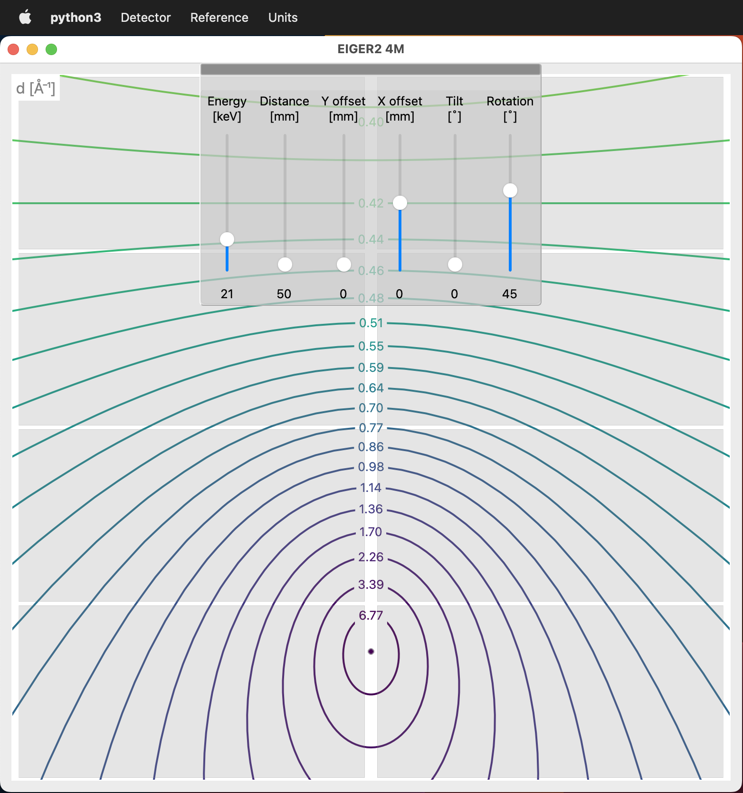

# detgeo_pyqt6
#### A tool to project X-ray diffraction cones on a detector screen at different geometries (tilt, rotation, offset) and X-ray energies
 - Main application is to visualize the maximum achievable resolution at a given geometry.
 - The math used is not meant to bring people to the moon but to provide a quick and simple preview.
 - The module building code is designed for [Dectris](https://www.dectris.com) [PILATUS3](https://www.dectris.com/detectors/x-ray-detectors/pilatus3/) / [EIGER2](https://www.dectris.com/detectors/x-ray-detectors/eiger2/) and [SACLA](https://sacla.xfel.jp/?lang=en) MPCCD Detectors (central hole geometry) but one-module systems like the [Bruker](https://www.bruker.com/en.html) [Photon II](https://www.bruker.com/en/products-and-solutions/diffractometers-and-scattering-systems/single-crystal-x-ray-diffractometers/sc-xrd-components/detectors.html) are possible as well.
 - It uses [python3](https://www.python.org), [numpy](https://numpy.org), [pyqt6](https://www.riverbankcomputing.com/software/pyqt/), [pyqtgraph](https://pyqtgraph.readthedocs.io/en/latest/), [contourpy](https://contourpy.readthedocs.io/en/v1.0.7/), [pyFAI](https://pyfai.readthedocs.io/en/v2023.1/) and [gemmi](https://project-gemmi.github.io/python-api/gemmi.UnitCell.html).

## Short how-to:
 - Choose a detector and a model from the _Detector_ menu.
 - Pick a reference from the _Reference_ menu to plot its contours ([pyFAI](https://pyfai.readthedocs.io/en/v2023.1/)).
 - Use the units from the _Units_ menu you are the most comfortable with.
 - Hover over the grey line at the top to show the sliders.
  - Click it to make it stay open.
  - Move it around but don't lose it!
 - Drag the sliders to change energy and geometry.
 - Edit the _settings.json_ file to suit your needs.
 - Add all the missing detectors to the _detectors.json_ file.

## Latest updates:
  - 2023-04-09 Update: drop a cif file onto the window to draw its contours (uses [pyFAI](https://pyfai.readthedocs.io/en/v2023.1/) and [gemmi](https://project-gemmi.github.io/python-api/gemmi.UnitCell.html]))
  - 2023-04-05 Update: uses pyqt6, pyqtgraph and contourpy, dropped matplotlib backend

## Older updates
  - 2023-03-23 Update: Settings are saved to (if doesn't exist) or loaded from (if exists) a 'settings.json' file.
  - 2023-03-23 Update: Added horizontal offset support and slider.
  - 2022-06-07 Update: Added functionality to plot Standard (LaB6, CeO2, ...) contours (needs [pyFAI](https://pyfai.readthedocs.io/en/master/)).
  - 2022-04-28 Update: Changed contour line generation to accept a list of 2-theta values as input.
  - 2022-04-27 Update: Added support for [SACLA](https://sacla.xfel.jp/?lang=en) MPCCD Detectors (central hole geometry).
  - 2022-04-25 Bugfix: calculation of the beamcenter (rotation and tilt).
  - 2022-04-25 Bugfix: unresponsive radio buttons / redrawing the figure.

## Here's an example showing a rotated EIGER2 4M:

##### I hope this turns out to be useful for someone!
